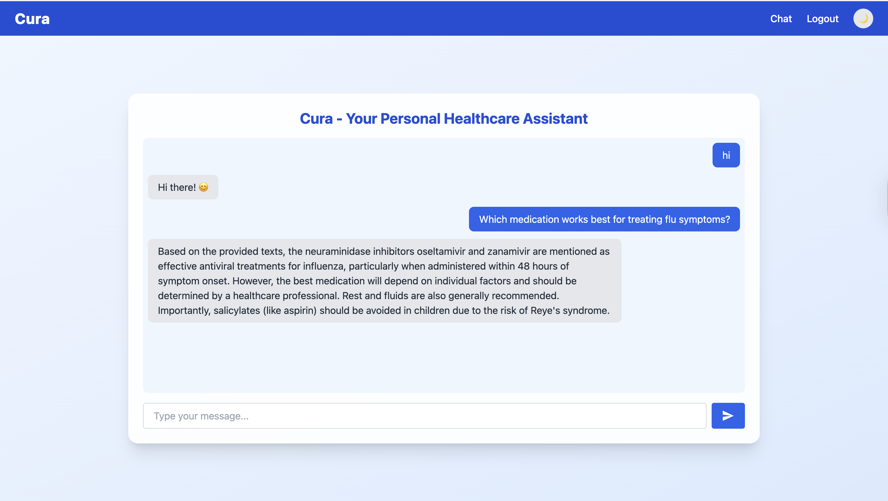
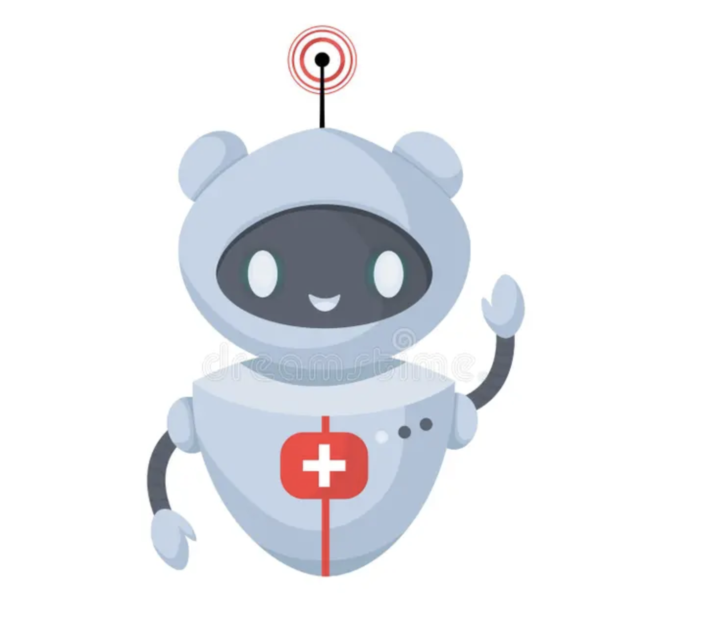

# Medical Assistance Bot using RAG (Retrieval Augmented Generation) Architecture

This repository contains the implementation of a state-of-the-art **Medical Assistance Bot** leveraging **RAG (Retrieval Augmented Generation) Architecture**. The bot is designed to provide **accurate, relevant, and timely information on a wide range of medical topics, enhancing patient care and supporting healthcare professionals.**

- **Vector Database Setup**
  - There are now two different databases to integrate with chatbots, using
    1. ChromaDB
    2. FAISS (Facebook AI Similarity Search)

**Important Note:**

- FAISS vector database requires a pointer to files, the metadata provides the chunk location -> (name_of_file, page_no., chunk_id), and it should be fetched manually.

Key Features:

- Utilizes **RAG architecture** to combine retrieval of relevant documents with generative capabilities.
- Provides **precise and context-aware responses** based on extensive medical knowledge.
- Supports a variety of medical queries ranging from **symptoms and conditions to treatments and medications**.

---

## Knowledge Base

The Medical Assistance Bot is equipped with comprehensive knowledge based on the following books and topics:

---

### 1. **Current Essentials of Medicine, Fourth Edition** by **Tierney, Saint and Whooley**

- Cardiovascular Diseases
- Pulmonary Diseases
- Gastrointestinal Diseases
- Hepatobiliary Disorders
- Hematologic Diseases
- Rheumatologic & Autoimmune Disorders
- Endocrine Disorders
- Infectious Diseases
- Oncologic Diseases
- Fluid, Acid–Base, and Electrolyte Disorders
- Genitourinary and Renal Disorders
- Neurologic Diseases
- Geriatrics
- Psychiatric Disorders
- Dermatologic Disorders
- Gynecologic, Obstetric, and Breast Disorders
- Common Surgical Disorders
- Common Pediatric Disorders
- Selected Genetic Disorders
- Common Disorders of the Eye
- Common Disorders of the Ear, Nose, and Throat
- Poisoning

---

### 2. **Diagnostic and Statistical Manual of Mental Disorders (DSM-5)** by **The American Psychiatric Association**

- Neurodevelopmental Disorders
- Schizophrenia Spectrum and Other Psychotic Disorders
- Bipolar and Related Disorders
- Depressive Disorders
- Anxiety Disorders
- Obsessive-Compulsive and Related Disorders
- Trauma- and Stressor-Related Disorders
- Dissociative Disorders
- Somatic Symptom and Related Disorders
- Feeding and Eating Disorders
- Elimination Disorders
- Sleep-Wake Disorders
- Sexual Dysfunctions
- Gender Dysphoria
- Disruptive, Impulse-Control, and Conduct Disorders
- Substance-Related and Addictive Disorders
- Neurocognitive Disorders
- Personality Disorders
- Paraphilic Disorders
- Other Mental Disorders
- Medication-Induced Movement Disorders and Other Adverse Effects of Medication
- Other Conditions That May Be a Focus of Clinical Attention
- Emerging Measures and Models

---

### 3. **Disease Handbook for Childcare Providers** by **New Hampshire Department of Health and Human Services**

- Immunization Requirements
- Diseases That Are Preventable With Vaccines
- When A Child Should Be Excluded Or Dismissed
- When Staff Should Be Excluded
- What Diseases Must Be Reported To Health Officials
- Child Abuse
- Diapering Recommendations
- Pets In Daycare Facilities
- Food Handling For Childcare Settings
- Rashes

---

### 4. **Essentials of Human Nutrition** by **Mann and Truswell**

- Energy and Macronutrients
- Organic and Inorganic Essential Nutrients
- Nutrition-Related Disorders
- Foods
- Nutritional Assessment
- Life Stages
- Clinical and Public Health
- Case Studies

---

### 5. **Indian First Aid Manual** by **Indian Red Cross Society**

- Basic First Aid Techniques
- Respiratory System and Breathing
- Heart, Blood Circulation, Shock
- Wounds and Injuries
- Bones, Joints and Muscles
- Nervous System and Unconsciousness
- Gastrointestinal Tract, Diarrhoea, Food Poisoning and Diabetes
- Skin, Burns, Heat Exhaustion, Fever and Hypothermia
- Poisoning
- Bites and Stings
- Senses, Foreign Bodies in Eye, Ear, Nose or Skin and Swallowed Foreign Objects
- Urinary System, Reproductive System and Emergency Childbirth
- Psychological First Aid
- Specific Emergency Situations and Disaster Management
- First Aid Techniques: Dressings, Bandages and Transport Techniques
- Content of a First Aid Kit

---

### 6. **Gerontological Nursing: Competencies for Care** by **Kristen L. Mauk**

- Foundations of Gerontological Nursing
- Communication with Older Adults
- Comprehensive Assessment and Skills
- Health Promotion and Disease Prevention in the Elderly
- Managing Illnesses and Health Conditions
- Assistive Technologies in Elder Care
- Ethical and Legal Issues in Gerontology
- Diversity and Intimacy in Aging
- Global Models of Health Care
- Interdisciplinary Team and Education
- Leadership and Future Trends

---

### 7. **Clinical Guidelines – Diagnosis and Treatment Manual** by **Dubois, Vasseur-Binachon, Yoshimoto**

- A Few Symptoms and Syndromes
- Respiratory Diseases
- Gastrointestinal Disorders
- Skin Diseases
- Eye Diseases
- Parasitic Diseases
- Bacterial Diseases
- Viral Diseases
- Genito-Urinary Diseases
- Medical and Minor Surgical Procedures
- Mental Disorders in Adults
- Other Conditions

---

### 8. **Pediatric Nursing and Health Care** by **Ethiopia Public Health Training Initiative**

- Introduction to Child Health
- History Taking and Physical Examination
- Essential Nursing Care for Hospitalized Children
- Care of the New Born
- Congenital Abnormalities
- Normal Growth and Development
- Nutrition and Nutritional Deficiencies
- Acute Respiratory Infections
- Control of Diarrhea
- Systemic Diseases
- Vaccine Preventable Diseases
- Expanded Program on Immunization (EPI)
- Common Genetic Problems of Children

---

## Getting Started

1. Clone this repository:  
   `git clone <repository_url>`

2. Install dependencies for backend and frontend.

3. Configure environment variables and API keys.

4. Set up vector database (ChromaDB or FAISS).

5. Run the backend server.

6. Start the frontend React app.

7. Open the app and start chatting with MediBot!

---

## Sample Output

See [SAMPLE_OUTPUT.md](SAMPLE_OUTPUT.md) for example conversations and responses.

---

## Screenshots

  

---

## Contributing

Contributions welcome! Please fork the repo and submit pull requests.

---

## License

[Specify your license here]

---

## Contact

Created by Bhawawni Shakar Sarswat

---
